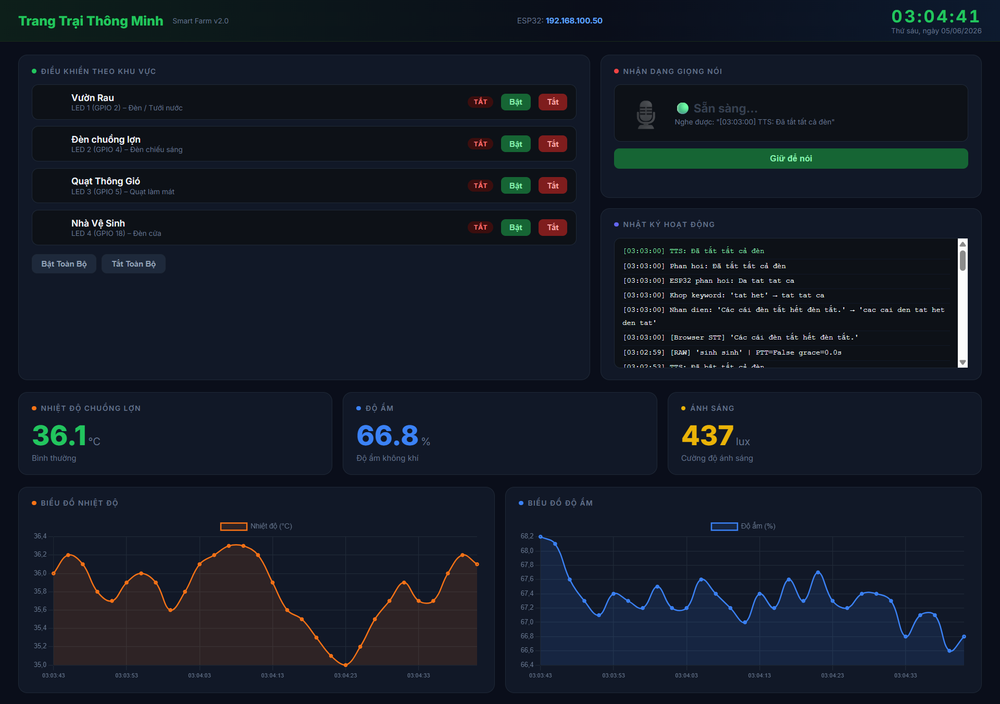

<h2 align="center">
    <a href="https://dainam.edu.vn/vi/khoa-cong-nghe-thong-tin">
    🎓 Faculty of Information Technology (DaiNam University)
    </a>
</h2>
<h2 align="center">
   Hệ thống quản lý trang trại thông minh qua giọng nói
</h2>
<div align="center">
    <p align="center">
        
        
        
    </p>

[](https://www.facebook.com/DNUAIoTLab)
[](https://dainam.edu.vn/vi/khoa-cong-nghe-thong-tin)
[](https://dainam.edu.vn)

</div>
Hệ thống điều khiển trang trại thông minh sử dụng **ESP32 + Python Flask**, hỗ trợ điều khiển bằng **giọng nói tiếng Việt**, giao diện web dashboard và giám sát cảm biến thời gian thực.

---

## 1. Cấu Trúc Thư Mục

```
smart-farm/
├── .pio/                   # PlatformIO build cache
├── .venv/                  # Python virtual environment
├── .vscode/                # Cấu hình VS Code
├── farm_server/            # (tham khảo / thư viện phụ)
├── include/                # Header files C++
├── lib/                    # Thư viện Arduino bên ngoài
├── src/
│   └── main.cpp            # Firmware ESP32 (Arduino/PlatformIO)
├── test/                   # Unit test PlatformIO
├── server.py               # Server Python: Flask + nhận diện giọng nói + dashboard
├── model/                  # Vosk model tiếng Việt (tải thêm – xem bên dưới)
├── platformio.ini          # Cấu hình build PlatformIO
└── README.md
```

---

## 2. Kiến Trúc Hệ Thống

```
[Micro / Trình duyệt]
        │  Web Speech API (tiếng Việt)
        ▼
[Python Flask Server – server.py]  ←→  [Dashboard Web :5000]
        │  HTTP GET /cmd?cmd=...
        ▼
[ESP32 WebServer – main.cpp]
        │  digitalWrite
        ▼
[LED/Relay: Tưới, Đèn, Quạt, Cửa]
```

- **server.py** chạy trên máy tính (PC / Raspberry Pi), lắng nghe giọng nói, xử lý lệnh và gửi HTTP đến ESP32.
- **main.cpp** chạy trên chip ESP32, nhận lệnh HTTP và điều khiển GPIO.

---

## 3. Cài Đặt & Chạy

### 3.1. Flash Firmware ESP32

**Yêu cầu:** [PlatformIO](https://platformio.org/) (extension VS Code hoặc CLI)

```bash
# Chỉnh WiFi trong src/main.cpp
const char* ssid     = "Ten_WiFi_Cua_Ban";
const char* password = "Mat_Khau_WiFi";

# Build & upload
pio run --target upload
```

Sau khi kết nối WiFi, mở **Serial Monitor** (115200 baud) để lấy địa chỉ IP của ESP32.

---

### 3.2. Cài Đặt Python Server

```bash
# Tạo và kích hoạt môi trường ảo
python -m venv .venv
source .venv/bin/activate        # Linux/macOS
.venv\Scripts\activate           # Windows

# Cài thư viện
pip install flask requests vosk sounddevice numpy edge-tts playsound
```

#### 3.3.Tải Vosk Model Tiếng Việt

```bash
# Tải model nhỏ (~40MB) tại: https://alphacephei.com/vosk/models
# Giải nén và đổi tên thư mục thành "model" đặt cạnh server.py
unzip vosk-model-small-vn-0.4.zip
mv vosk-model-small-vn-0.4 model
```

#### 3.4.Cấu Hình IP ESP32

Mở `server.py`, sửa dòng:

```python
ESP32_IP = "192.168.100.50"   # ← thay bằng IP thực của ESP32
```

#### 3.5. Khởi Chạy Server

```bash
python server.py
```

Trình duyệt sẽ tự mở tại **http://localhost:5000**

---


## 4. Tính năng hệ thống
#### 4.1. Lệnh Giọng Nói Hỗ Trợ

Nhấn và **giữ nút "Giữ để nói lệnh"** trên dashboard, nói rõ một trong các lệnh sau:

| Lệnh nói               | Hành động                        |
|------------------------|----------------------------------|
| "Bật vườn rau"         | Bật máy bơm tưới                 |
| "Tắt vườn rau"         | Tắt máy bơm tưới                 |
| "Bật chuồng lợn"       | Bật đèn + quạt chuồng lợn        |
| "Tắt chuồng lợn"       | Tắt đèn + quạt chuồng lợn        |
| "Bật quạt"             | Bật quạt thông gió               |
| "Tắt quạt"             | Tắt quạt thông gió               |
| "Bật nhà vệ sinh"      | Mở cửa / bật đèn nhà vệ sinh     |
| "Tắt nhà vệ sinh"      | Đóng cửa / tắt đèn nhà vệ sinh   |
| "Bật tất cả"           | Bật toàn bộ thiết bị             |
| "Tắt tất cả"           | Tắt toàn bộ thiết bị             |
| "Trạng thái / Kiểm tra"| Đọc trạng thái hệ thống          |
| "Nhiệt độ"             | Đọc nhiệt độ chuồng lợn          |
| "Độ ẩm"                | Đọc độ ẩm hiện tại               |
| "Ánh sáng"             | Đọc cường độ ánh sáng            |

> Hệ thống hỗ trợ nhận diện **cả có dấu lẫn không dấu** và fuzzy matching để xử lý lỗi phát âm.

---

#### 4.2. API ESP32 (HTTP)

ESP32 khởi chạy WebServer trên cổng **80**, hỗ trợ các endpoint:

| Endpoint                     | Mô tả                          |
|------------------------------|--------------------------------|
| `GET /`                      | Liệt kê các lệnh hỗ trợ        |
| `GET /cmd?cmd=bat tuoi`      | Bật tưới                       |
| `GET /cmd?cmd=tat tuoi`      | Tắt tưới                       |
| `GET /cmd?cmd=bat den`       | Bật đèn                        |
| `GET /cmd?cmd=tat den`       | Tắt đèn                        |
| `GET /cmd?cmd=bat quat`      | Bật quạt                       |
| `GET /cmd?cmd=tat quat`      | Tắt quạt                       |
| `GET /cmd?cmd=mo cua`        | Mở cửa                         |
| `GET /cmd?cmd=dong cua`      | Đóng cửa                       |
| `GET /cmd?cmd=bat tat ca`    | Bật tất cả                     |
| `GET /cmd?cmd=tat tat ca`    | Tắt tất cả                     |
| `GET /status`                | Trả về JSON trạng thái LED     |

**Ví dụ response `/status`:**
```json
{
  "tuoi": false,
  "den": true,
  "quat": true,
  "cua": false,
  "last_cmd": "Bat den"
}
```

---

#### 4.3. Cảnh Báo Tự Động

Server tự động giám sát cảm biến và phát cảnh báo **TTS (Text-to-Speech)** khi:

- **Nhiệt độ chuồng lợn ≥ 39°C** → Phát cảnh báo giọng nói và hiển thị trên dashboard.
- Nhiệt độ trở về bình thường → Thông báo hết cảnh báo.

> Dữ liệu cảm biến hiện tại là **giả lập (random walk)**. Tích hợp cảm biến thực (DHT22, BH1750...) thông qua endpoint `/status` hoặc MQTT.

---

#### 4.4. Dashboard Web

Truy cập **http://localhost:5000** để:

- Xem trạng thái ON/OFF từng khu vực theo thời gian thực
- Bấm nút bật/tắt trực tiếp
- Xem biểu đồ nhiệt độ, độ ẩm, ánh sáng (cập nhật mỗi giây)
- Sử dụng micro trình duyệt (Web Speech API – cần Chrome/Edge)
- Xem log hoạt động hệ thống

### Giao diện hệ thống!


---

## 5. Công Nghệ Sử Dụng

| Thành phần     | Công nghệ                              |
|----------------|----------------------------------------|
| Vi điều khiển  | ESP32 (Arduino framework, PlatformIO)  |
| Web server IoT | ESP32 WebServer library                |
| Backend PC     | Python 3, Flask                        |
| Nhận diện giọng| Vosk (offline) + Web Speech API (online)|
| Text-to-Speech | edge-tts (Microsoft Azure Neural TTS)  |
| Dashboard UI   | HTML/CSS/JS thuần, Chart.js            |
| Kết nối        | WiFi, HTTP REST                        |

---

## 6. Xử Lý Lỗi Thường Gặp

**ESP32 không kết nối WiFi:**
- Kiểm tra `ssid` / `password` trong `main.cpp`
- Đảm bảo router dùng băng tần 2.4GHz (ESP32 không hỗ trợ 5GHz)

**Server không gửi được lệnh đến ESP32:**
- Kiểm tra `ESP32_IP` trong `server.py` khớp với IP trên Serial Monitor
- Đảm bảo PC và ESP32 cùng mạng WiFi

**Vosk không nhận diện được:**
- Kiểm tra thư mục `model/` tồn tại và đúng đường dẫn
- Thử model lớn hơn để độ chính xác cao hơn

**Lỗi TTS (`edge-tts`):**
- Cần kết nối Internet để dùng edge-tts
- Cài `playsound==1.2.2` (các phiên bản mới có thể lỗi trên Windows)

---

## Giấy Phép

Dự án học tập – tự do sử dụng và chỉnh sửa.
